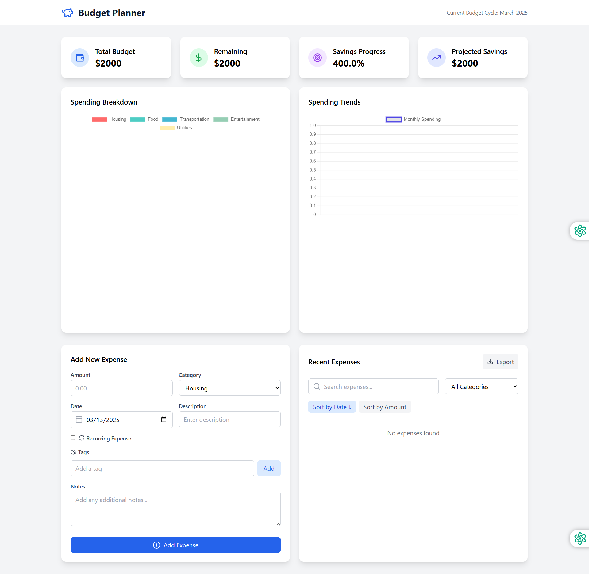

# Advanced Budget Planner

A comprehensive personal finance management application built with modern web technologies. Track expenses, manage budgets, and visualize your financial health with intuitive charts and analytics.



## Features

### Core Functionality
- 📊 Dynamic budget allocation across categories
- 💰 Real-time expense tracking
- 📈 Visual analytics with interactive charts
- 🎯 Smart savings goals with progress tracking
- 📱 Fully responsive design for all devices
- 💾 Persistent storage with automatic saving

### Advanced Features
- 🔄 Recurring expenses management
- 📅 Monthly budget cycles
- 📊 Advanced spending analytics
- 💡 Smart budget recommendations
- 🏷️ Custom category management
- 📤 Data export functionality
- 🔔 Budget alerts and notifications
- 📈 Trend analysis and forecasting

## Tech Stack

- **Frontend Framework**: Vue.js
- **Build Tool**: Vite
- **Styling**: Tailwind CSS
- **Charts**: Chart.js (via react-chartjs-2)
- **Icons**: Lucide React
- **Date Handling**: date-fns
- **State Management**: React Hooks
- **Storage**: Local Storage with encryption (instead of Firebase)

## Getting Started

1. Install dependencies:
   ```bash
   npm install
   ```
2. Start the development server:
   ```bash
   npm run dev
   ```

## Usage Guide

### Setting Up Your Budget
1. Define your total monthly budget
2. Allocate amounts to predefined categories
3. Set your savings goal
4. Configure recurring expenses

### Managing Expenses
1. Add new expenses with detailed information
2. Categorize and track spending
3. View real-time budget updates
4. Monitor category-wise spending

### Analytics
1. View spending trends
2. Analyze category distribution
3. Track savings progress
4. Export financial reports

## Demo 
(https://advanced-budget-planner.netlify.app/)